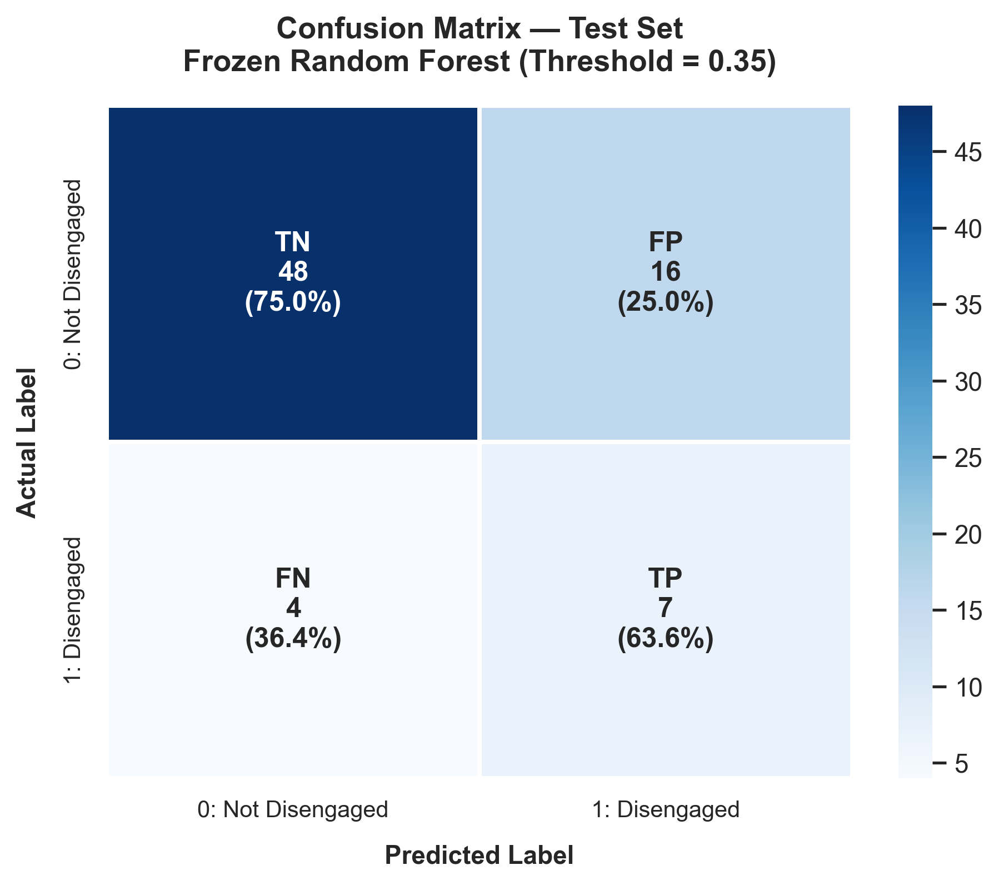
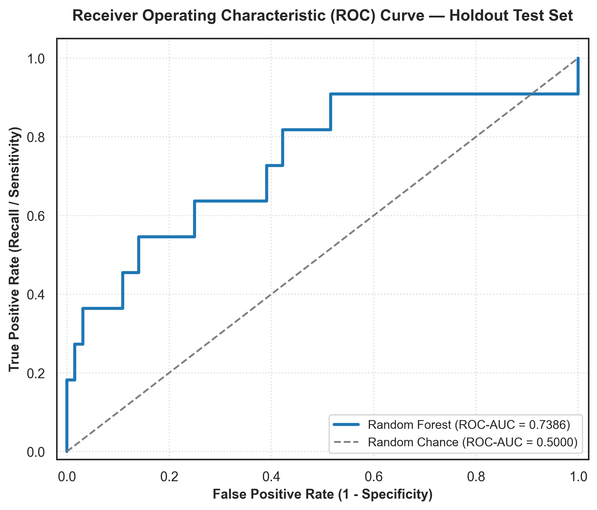
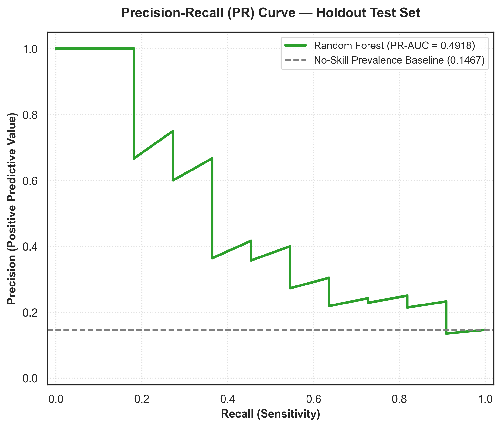
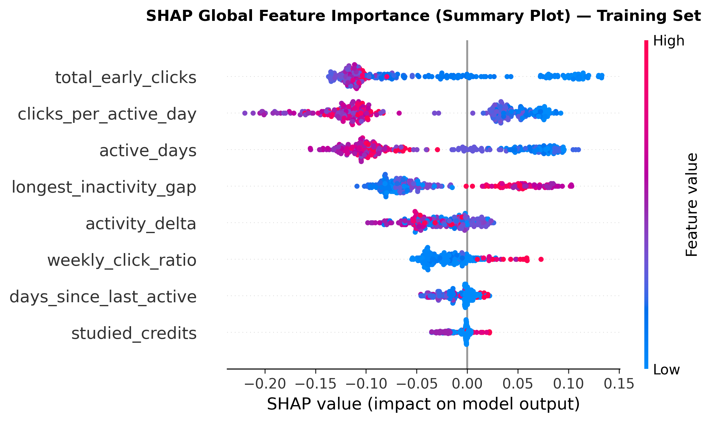

# Early Learner Disengagement Prediction

An end-to-end machine learning system for identifying learners at risk of disengaging before disengagement becomes visible through final outcomes.

The project uses behavioral activity from the **Open University Learning Analytics Dataset (OULAD)** to build an early-warning pipeline combining feature engineering, leakage-safe model development, threshold-based risk classification, SHAP explainability, rule-based intervention recommendations, and an interactive Streamlit dashboard.

**Project scope:** AAA-2013J  
**Observation window:** Days 0–14  
**Outcome window:** Days 15–42

---

## Quick Links

- **Repository:** [GitHub](.)
- **Dashboard:** Add the deployed Streamlit Cloud URL here when available.
- **Dataset:** [OULAD](https://analyse.kmi.open.ac.uk/open_dataset)

---

## Project Snapshot

| Component | Implementation |
|---|---|
| Dataset | Open University Learning Analytics Dataset (OULAD) |
| Initial scope | AAA-2013J |
| Eligible learners | 372 |
| Observation window | Days 0–14 |
| Prediction target | Future disengagement |
| Final model | Tuned Random Forest |
| Operational threshold | 0.35 |
| Explainability | SHAP |
| Recommendations | Rule-based intervention engine |
| Interface | Streamlit dashboard |

---

## Quick Results

| Metric | Final Holdout Result |
|---|---:|
| Accuracy | 73.33% |
| Precision | 30.43% |
| Recall | 63.64% |
| F1 | 0.412 |
| ROC-AUC | 0.739 |
| PR-AUC | 0.492 |

**Holdout set:** 75 learners, including 11 disengaged learners.  
**Threshold:** 0.35  
**Flagged:** 23/75 learners (30.67%)

---

## Why This Project?

Many learning analytics systems analyze performance after major outcomes have already occurred. An early-warning system instead asks:

> **Can early behavioral activity be used to identify learners who may disengage later, while there is still time for human support?**

This project treats disengagement as a **future behavioral outcome**, not simply as the learner's final course result.

The system is designed as a **decision-support tool**:

```text
Early LMS Activity
       ↓
Feature Engineering
       ↓
ML Disengagement Probability
       ↓
Risk Classification
       ↓
SHAP Explanation
       ↓
Rule-Based Recommendation
       ↓
Human Review / Support
```

---

# Problem Statement

Online learning platforms generate large amounts of behavioral data such as clicks, active days, and periods of inactivity. However, raw activity data alone does not directly answer whether a learner is becoming disengaged.

The objective of this project is to develop an early-warning machine learning pipeline that:

1. Uses only information available during the first 14 days.
2. Predicts disengagement occurring after the observation window.
3. Avoids temporal and preprocessing leakage.
4. Handles class imbalance explicitly.
5. Produces an operational risk classification.
6. Explains predictions using SHAP.
7. Provides rule-based support recommendations for human review.
8. Presents the results through an interactive dashboard.

---

# Research Questions

1. Can early behavioral activity predict future learner disengagement?
2. Which early behavioral signals are most informative?
3. How do Logistic Regression, Random Forest, and XGBoost compare?
4. Does hyperparameter tuning improve performance?
5. How does changing the classification threshold affect recall, precision, and workload?
6. Can model predictions be explained at both global and individual-learner levels?
7. Can model outputs be converted into transparent, rule-based support recommendations?

---

# Dataset

## Open University Learning Analytics Dataset (OULAD)

OULAD is a public dataset containing information about courses, students, assessments, registrations, and virtual learning environment (VLE) interactions.

The dataset contains multiple course presentations and a much larger learner population than the subset used in this implementation.

### Part 1 — Current Implementation

The initial implementation intentionally focuses on **AAA-2013J**.

The selected presentation contains **383 registered learners**. After applying the eligibility rule that excludes learners who unregistered on or before Day 14, **372 learners** remain for modeling.

This controlled single-presentation scope was chosen to establish and validate the complete end-to-end early-warning workflow under a fixed course/presentation context.

### Part 2 — Planned Expansion

The broader OULAD dataset provides an opportunity to extend the project beyond a single presentation.

Future experiments can evaluate the pipeline across additional course presentations to test:

- temporal generalization,
- course-to-course variation,
- robustness of the engineered behavioral features,
- threshold stability,
- model performance across different learner populations.

The current results should therefore be interpreted as results for **AAA-2013J**, rather than as evidence that the model generalizes to the entire OULAD population.

### Source

Kuzilek, J., Hlosta, M., & Zdrahal, Z. (2017). *Open University Learning Analytics dataset*. Scientific Data, 4, 170171.

DOI: 10.1038/sdata.2017.171

---

# Prediction Framework

The project separates **what is known at prediction time** from **what happens afterward**.

| Period | Role |
|---|---|
| Days 0–14 | Predictor / observation window |
| End of Day 14 | Prediction point |
| Days 15–42 | Outcome window |

Only information available during Days 0–14 is used as a predictor.

This temporal separation is central to the project's leakage-prevention strategy.

---

# Target Definition

The target is a custom future-disengagement definition.

A learner is labeled **disengaged = 1** if at least one of the following occurs during the outcome period:

1. Official withdrawal occurs during Days 15–42.
2. The learner has a longest inactivity streak of at least 14 days.
3. TMA 01 is missed when it is due on Day 19.

Learners who unregistered on or before Day 14 are excluded because they do not have the required future observation period.

### Final Target Distribution

| Outcome | Learners | Percentage |
|---|---:|---:|
| Disengaged | 54 | 14.52% |
| Non-disengaged | 318 | 85.48% |
| Total eligible | 372 | 100% |

The three disengagement triggers produced 67 trigger occurrences, with 13 learners satisfying more than one trigger.

`final_result` is **not used as a predictor**, because it is a retrospective course outcome and would introduce information that would not be available at the prediction point.

---

# Feature Engineering

Eight behavioral and academic-context features were engineered from the Day 0–14 observation window:

| Feature | Description |
|---|---|
| `total_early_clicks` | Total VLE interactions during Days 0–14 |
| `clicks_per_active_day` | Average clicks on days when the learner was active |
| `active_days` | Number of distinct active days |
| `longest_inactivity_gap` | Longest observed inactivity gap within the early period |
| `days_since_last_active` | Days since the learner's latest observed activity |
| `activity_delta` | Change in activity between the early weeks |
| `weekly_click_ratio` | Relative change between Week 1 and Week 2 activity |
| `studied_credits` | Credits associated with the learner's study context |

Features such as demographic attributes were excluded from the modeling pipeline for responsible-use considerations.

Assessment predictors were also not available for this specific AAA-2013J Day 0–14 setup because TMA 01 is due on Day 19.

---

# Architecture

```text
                     OULAD
                       │
          ┌────────────┴────────────┐
          │                         │
     Student Data              VLE Activity
          │                         │
          └────────────┬────────────┘
                       ↓
              Problem Definition
              AAA-2013J + Target
                       ↓
              Feature Engineering
                Day 0–14 Only
                       ↓
             Train / Test Split
             Stratified 80 / 20
                       ↓
              Preprocessing Pipeline
            Imputation + Scaling +
                 Encoding
                       ↓
          ┌────────────┴────────────┐
          │                         │
     Model Comparison        Hyperparameter Tuning
          │                         │
          └────────────┬────────────┘
                       ↓
            OOF Threshold Selection
                       ↓
              Frozen Final Model
                       ↓
              Holdout Test Evaluation
                       ↓
        ┌──────────────┼──────────────┐
        ↓              ↓              ↓
   Predictions       SHAP        Recommendations
        │              │              │
        └──────────────┴──────────────┘
                       ↓
                Streamlit Dashboard
```

---

# Data Leakage Prevention

Leakage prevention is one of the most important design principles of this project.

### Temporal leakage

Only Days 0–14 are used for predictors. Future information from Days 15–42 is used only to construct the target.

### Target leakage

`final_result` is excluded from the feature set because it is known only retrospectively.

### Preprocessing leakage

Imputation, scaling, and encoding are contained inside a scikit-learn `Pipeline` / `ColumnTransformer`. During cross-validation, preprocessing is fitted separately within each training fold rather than on the complete dataset.

### Test-set leakage

The 20% holdout test set is not used for:

- model comparison,
- hyperparameter tuning,
- threshold selection,
- feature decisions,
- recommendation-rule tuning.

The holdout is evaluated only after the model and operational threshold are frozen.

### Synthetic oversampling

SMOTE was not used because the project prioritizes a simple, reproducible workflow and avoids introducing synthetic observations into the early-warning modeling process.

---

# Models Compared

The initial model comparison included:

- Dummy Classifier
- Logistic Regression
- Random Forest
- XGBoost

Random Forest and XGBoost were subsequently tuned because their initial performance was relatively close.

The primary evaluation metric during model selection was **PR-AUC (Average Precision)** because the disengagement class is relatively small.

Recall, precision, F1, and ROC-AUC were also monitored.

---

# Cross-Validation Results

Five-fold stratified cross-validation was performed on the training data only.

**Important:** The table below reports model metrics at the default **0.50 classification threshold**. The later threshold-selection step uses out-of-fold probabilities and evaluates alternative thresholds, including the final operational threshold of 0.35.

| Model | ROC-AUC | F1 | Precision | Recall | PR-AUC |
|---|---:|---:|---:|---:|---:|
| Dummy | 0.500 | 0.000 | 0.000 | 0.000 | 0.145 |
| Logistic Regression | 0.768 | 0.423 | 0.294 | 0.761 | 0.405 |
| Random Forest | 0.820 | 0.362 | 0.475 | 0.303 | 0.516 |
| XGBoost | 0.810 | 0.391 | 0.456 | 0.347 | 0.476 |
| Tuned Random Forest | 0.840 | 0.528 | 0.467 | 0.622 | 0.564 |
| Tuned XGBoost | 0.811 | 0.494 | 0.437 | 0.572 | 0.572 |

These metrics are cross-validation estimates on the training set and are not the final holdout results.

---

# Model and Threshold Selection

The final model was selected using **out-of-fold (OOF) predictions on the training set**.

The threshold was evaluated using operational constraints:

- Minimum recall: **70%**
- Maximum flagged learners: **30%**
- Minimum precision: **30%**

The selected configuration was:

**Random Forest + threshold 0.35**

OOF performance at this threshold:

| Metric | OOF Result |
|---|---:|
| Recall | 74.42% |
| Precision | 37.21% |
| F1 | 0.496 |
| Flagged | 86 / 297 |
| Flagged percentage | 28.96% |

The operational threshold was chosen to prioritize recall under a constrained review workload. In an educational early-warning setting, the system is intended to **surface learners for human review**, not make autonomous decisions. Accepting some false positives is therefore an explicit operational trade-off, while false negatives remain an important limitation.

The tuned Random Forest was then refit on the complete training set. The test set remained untouched until final evaluation.

---

# Final Holdout Test Results

After model and threshold selection, the frozen model was evaluated once on the unseen 20% holdout set.

### Test Set

- Learners: **75**
- Non-disengaged: **64**
- Disengaged: **11**
- Operational threshold: **0.35**

| Metric | Result |
|---|---:|
| Accuracy | 73.33% |
| Precision | 30.43% |
| Recall | 63.64% |
| F1 | 0.412 |
| ROC-AUC | 0.739 |
| PR-AUC | 0.492 |

### Confusion Matrix

|  | Predicted 0 | Predicted 1 |
|---|---:|---:|
| Actual 0 | 48 | 16 |
| Actual 1 | 4 | 7 |

At the 0.35 threshold, **23 of 75 learners (30.67%)** were flagged.

The small test set means these metrics should be interpreted with caution. In particular, four false negatives among only eleven positive cases materially affect recall.

The test-set flagged percentage is slightly above the 30% OOF workload constraint. This is expected because the constraint was applied during training-side OOF threshold selection, not enforced by modifying the test results.

### Visual Results

#### Confusion Matrix



#### ROC Curve



#### Precision-Recall Curve



---

# Risk Classification

The predicted probability is converted into three operational risk levels:

| Risk Level | Probability |
|---|---|
| LOW | `< 0.35` |
| MEDIUM | `0.35 – 0.65` |
| HIGH | `> 0.65` |

The operational classification threshold remains **0.35**.

These risk levels are intended for prioritization and human review, not as definitive statements about a learner's future behavior.

---

# SHAP Explainability

SHAP is used to explain both:

1. **Global model behavior** — which features contribute most across the training population.
2. **Individual predictions** — which features pushed a learner's prediction higher or lower.

The global mean absolute SHAP ranking for the final Random Forest was:

| Rank | Feature |
|---|---|
| 1 | `total_early_clicks` |
| 2 | `clicks_per_active_day` |
| 3 | `active_days` |
| 4 | `longest_inactivity_gap` |
| 5 | `activity_delta` |
| 6 | `weekly_click_ratio` |
| 7 | `days_since_last_active` |
| 8 | `studied_credits` |



A positive SHAP contribution indicates that the feature pushed the model output toward higher disengagement probability for that learner; a negative contribution indicates the opposite.

---

# Intervention Recommendation Engine

The project includes a transparent, **rule-based recommendation layer** after prediction and explanation.

Examples include:

- **LOW → Monitor**
- **MEDIUM + declining activity → Nudge**
- **MEDIUM + missed early assessment signal → Reminder**
- **HIGH + long inactivity gap → Outreach**
- **HIGH + declining activity + missed assessment → Urgent Outreach**

The recommendation engine does **not** retrain or modify the machine learning model.

These recommendations are demonstration heuristics only. Their effectiveness in reducing actual disengagement has **not** been experimentally validated.

---

# Interactive Streamlit Dashboard

The Streamlit dashboard provides four views:

### 1. Overview

- total eligible learners
- operational risk distribution
- average disengagement probability
- high-risk count

### 2. Behavioral Analysis

Visualizes early behavioral signals such as:

- total clicks,
- activity trends,
- inactivity gaps,
- differences between risk groups.

### 3. At-Risk Learners

Displays learners classified as **MEDIUM or HIGH** with:

- Student ID
- Risk Level
- Disengagement Probability
- Behavioral indicators
- Recommendation

The table can also be downloaded as CSV.

### 4. Individual Learner

Provides:

- predicted probability,
- risk level,
- behavioral feature values,
- top SHAP factors,
- rule-based recommendation.

The dashboard is an interface over the existing prediction pipeline. It does not retrain the model or change the operational threshold.

---

# Key Findings

1. **Early behavioral activity contains useful predictive signal.**  
   Activity volume, active days, and inactivity behavior were among the most influential features in the final model.

2. **Class imbalance changes how performance should be interpreted.**  
   PR-AUC, recall, precision, and F1 were emphasized rather than relying on accuracy alone.

3. **Hyperparameter tuning improved the tree-based models' training-side cross-validation results.**  
   The tuned Random Forest and XGBoost produced higher recall and F1 than their untuned versions at the default threshold.

4. **Threshold selection materially changes operational behavior.**  
   A threshold of 0.35 increased the number of learners flagged compared with the default 0.50 threshold and was selected using OOF predictions under explicit recall, precision, and workload constraints.

5. **The final holdout performance is more modest than the training-side OOF results.**  
   This demonstrates why a completely untouched test set is necessary when evaluating an ML system.

6. **Model explanations provide a behavioral interpretation layer.**  
   SHAP identifies which early features contributed to individual predictions instead of presenting only a risk label.

---

# Practical Application

A production version of this system could be integrated into an educational support workflow.

```text
LMS Activity
     ↓
Daily / Periodic Feature Update
     ↓
Disengagement Probability
     ↓
Risk Level
     ↓
Support Team Review
     ↓
Appropriate Human Intervention
     ↓
Outcome Monitoring
```

Potential users include:

- universities,
- online learning platforms,
- corporate learning systems,
- academic support teams.

The model should function as **decision support**, with educators or support staff retaining responsibility for interpreting the prediction and deciding whether any intervention is appropriate.

---

# Project Structure

```text
early-learner-disengagement/
│
├── data/
│   └── raw/                         # OULAD files, excluded from Git
│
├── dashboard/
│   └── app.py                       # Streamlit dashboard
│
├── models/
│   ├── best_model.joblib            # Frozen final model
│   ├── predictions.csv              # Current cohort predictions
│   ├── features.csv                 # Engineered features
│   ├── shap_values.npy              # SHAP values
│   ├── shap_feature_names.npy       # SHAP feature names
│   ├── shap_train_ids.npy           # Training learner IDs
│   ├── shap_global.png              # Global SHAP plot
│   ├── confusion_matrix.png         # Test confusion matrix
│   ├── roc_curve.png                # Test ROC curve
│   └── pr_curve.png                 # Test PR curve
│
├── notebooks/
│   └── 01_eda.ipynb                 # Exploratory data analysis
│
├── src/
│   ├── data_loader.py               # OULAD loading
│   ├── problem_definition.py        # Scope and target definition
│   ├── feature_engineering.py       # Day 0–14 feature creation
│   ├── model.py                     # Modeling, CV, tuning, selection
│   ├── evaluate.py                  # Final holdout evaluation
│   ├── predict.py                   # Inference and risk classification
│   ├── explain.py                   # SHAP explainability
│   └── recommend.py                 # Rule-based recommendations
│
├── run_pipeline.py                  # Generate deployment artifacts
├── requirements.txt
├── start.bat
├── start.sh
├── .streamlit/
│   └── config.toml
├── .gitignore
└── README.md
```

---

# Setup Instructions

## 1. Clone the repository

```bash
git clone <YOUR_GITHUB_REPOSITORY_URL>
cd early-learner-disengagement
```

## 2. Create a virtual environment

### Windows

```bash
python -m venv .venv
.venv\Scripts\activate
```

### macOS / Linux

```bash
python3 -m venv .venv
source .venv/bin/activate
```

## 3. Install dependencies

```bash
pip install -r requirements.txt
```

## 4. Add the OULAD dataset

Download the OULAD dataset from the official Open University dataset page and place the CSV files inside:

```text
data/raw/
```

The raw dataset is intentionally excluded from Git because the complete source data is not part of the repository.

---

# Run Locally

The repository contains a pipeline runner that regenerates the current prediction and feature artifacts from the raw OULAD data.

Run:

```bash
python run_pipeline.py
```

Then start the dashboard:

```bash
streamlit run dashboard/app.py
```

Or use the provided startup scripts:

### Windows

```bat
start.bat
```

### macOS / Linux

```bash
./start.sh
```

The pipeline will:

1. Load OULAD.
2. Scope AAA-2013J.
3. Apply the project eligibility and target definitions.
4. Generate Day 0–14 features.
5. Load the frozen model.
6. Generate predictions and risk levels.
7. Generate rule-based recommendations.
8. Save the deployment artifacts used by the dashboard.

---

# Streamlit Cloud Deployment

The dashboard is designed to run using the **pre-generated model and output artifacts committed to the repository**.

Streamlit Cloud should not be assumed to execute the full training or data-generation pipeline automatically.

For deployment:

1. Connect the GitHub repository to Streamlit Cloud.
2. Set the main application file to:

```text
dashboard/app.py
```

3. Ensure `requirements.txt` contains the required packages.
4. Ensure the required small model/output artifacts are committed under `models/`.
5. Deploy.

The raw OULAD files remain excluded from Git.

For a reviewer who wants to reproduce the pipeline from raw data:

```text
Download OULAD
      ↓
Place CSV files in data/raw/
      ↓
python run_pipeline.py
      ↓
streamlit run dashboard/app.py
```

---

# Deployment Configuration

The repository includes:

- `.streamlit/config.toml` for dashboard appearance.
- `start.bat` for Windows.
- `start.sh` for macOS/Linux.
- `requirements.txt` for Python dependencies.

The deployment artifacts are intentionally separated from the raw dataset so the public repository remains lightweight while still containing the frozen model and dashboard-ready outputs.

---

# Limitations

### 1. Single course presentation

The current implementation is limited to **AAA-2013J**. Performance across other OULAD presentations has not yet been established.

### 2. Dataset age

OULAD represents historical online learning activity. Modern LMS behavior and learner populations may differ.

### 3. Custom target definition

The disengagement label combines withdrawal, inactivity, and missed-assessment behavior. Different institutions may require a different operational definition.

### 4. Small positive class

Only 54 of the 372 eligible learners were labeled disengaged. The final test set contains only 11 positive cases, so holdout metrics have substantial uncertainty.

### 5. Threshold dependence

The 0.35 threshold was selected under specific operational constraints. A real deployment would need stakeholder-defined workload and intervention costs.

### 6. No probability calibration

The model outputs are treated as estimated probabilities for ranking and thresholding. Formal probability calibration was not performed.

### 7. Recommendations are not validated interventions

The recommendation engine contains rule-based heuristics. No experiment was conducted to establish that these recommendations reduce disengagement.

### 8. Generalization and fairness

The current project does not establish performance across multiple course presentations or demographic groups. Further evaluation would be required before real-world deployment.

---

# Responsible Use

This system should be used as an **early-warning decision-support tool**, not as an automated decision maker.

A high-risk prediction does not prove that a learner will disengage. Likewise, a low-risk prediction does not guarantee continued engagement.

Predictions should be reviewed alongside appropriate academic context, and interventions should be supportive rather than punitive.

The current implementation intentionally excludes demographic attributes from the model. Future versions should include explicit fairness evaluation before any real-world deployment.

---

# Future Work

## Dataset and Generalization

- Extend evaluation to multiple course presentations.
- Test temporal generalization on later presentations.
- Compare performance across different course contexts.
- Evaluate threshold stability across cohorts.

## Modeling

- Probability calibration.
- More systematic threshold analysis.
- Gradient boosting and other ensemble methods.
- Sequence-based models such as LSTM or Transformer architectures for richer temporal activity patterns.

## Explainability and Fairness

- Fairness metrics across relevant groups.
- Stability of SHAP explanations across cohorts.
- Counterfactual explanations.
- Human evaluation of explanation usefulness.

## Production System

- LMS/API integration.
- Automated periodic scoring.
- Model drift monitoring.
- Data-quality monitoring.
- Prediction logging and audit trails.

## Intervention Evaluation

- Connect recommendations to actual support actions.
- Measure intervention outcomes.
- Conduct controlled experiments such as A/B testing where ethically and institutionally appropriate.
- Evaluate whether early interventions reduce disengagement rather than merely increasing contact volume.

---

# License

This project is licensed under the **MIT License**.

The MIT License applies to the original code in this repository. The OULAD dataset is not covered by this project license; users should refer to the dataset provider's terms for its use and redistribution.

See the [`LICENSE`](LICENSE) file for the complete license text.

---

# References

1. Kuzilek, J., Hlosta, M., & Zdrahal, Z. (2017). *Open University Learning Analytics dataset*. Scientific Data, 4, 170171.  
   DOI: 10.1038/sdata.2017.171

2. Lundberg, S. M., & Lee, S.-I. (2017). *A Unified Approach to Interpreting Model Predictions*. Advances in Neural Information Processing Systems.

3. Pedregosa, F. et al. (2011). *Scikit-learn: Machine Learning in Python*. Journal of Machine Learning Research, 12, 2825–2830.

---

# Technologies

- Python
- Pandas
- NumPy
- Scikit-learn
- XGBoost
- SHAP
- Joblib
- Matplotlib
- Seaborn
- Plotly
- Streamlit
- Jupyter Notebook
- Git / GitHub

---

# Project Status

**End-to-end implementation complete.**

Current pipeline includes:

- [x] OULAD data loading
- [x] Problem definition and cohort scoping
- [x] Custom future-disengagement target
- [x] Exploratory data analysis
- [x] Leakage-safe feature engineering
- [x] Stratified train/test split
- [x] Preprocessing pipeline
- [x] Baseline model comparison
- [x] Random Forest and XGBoost tuning
- [x] OOF threshold selection
- [x] Final holdout evaluation
- [x] SHAP global and individual explanations
- [x] Rule-based intervention recommendations
- [x] Streamlit decision-support dashboard
- [x] Deployment configuration
- [x] Reproducible local pipeline runner

---

## Disclaimer

This project is an educational and research-oriented machine learning implementation. The model, risk levels, explanations, and intervention recommendations have not been validated for use in real educational decision-making.

They should not be used to make high-stakes decisions about learners without appropriate institutional validation, human oversight, privacy protections, fairness evaluation, and intervention testing.
